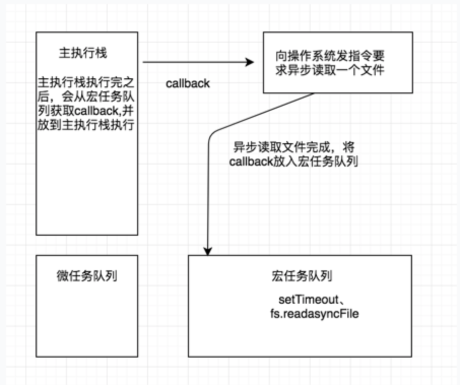
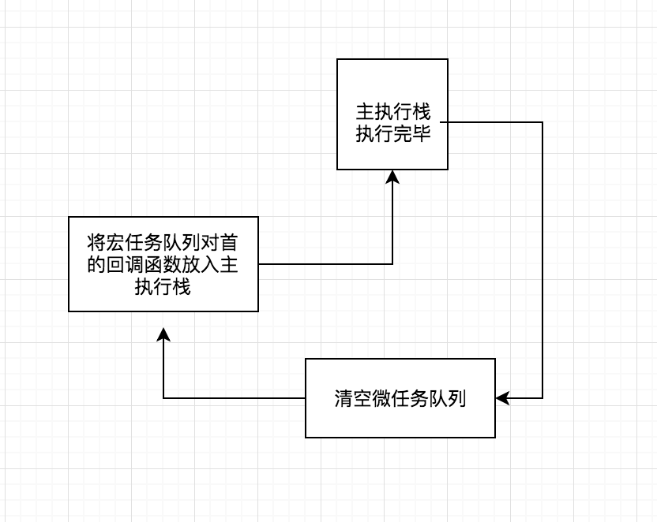

## 异步发展流程
### 1、事件轮询机制
在说异步之前，我们有必要了解一下js的事件轮询机制

主执行栈里的任务，即是我们的同步任务，宏任务队列即是我们所说的异步任务例如js中的``setTimeout``，node里的``readasyncFile``等，而微任务则例如es6中的``promise``,node里的``process.nextTick``

而整个事件则是以如下方式进行执行：


这便是我们的``事件轮询机制``

---

### 2、传统的异步方案
传统的异步解决方案是采用``回调函数``的形式，但采用这种方案有一下几个问题：
- 无法捕获try/catch
  - 因为回调函数被存放了起来，直到下一个事件环的时候才会取出,try只能捕获当前循环内的异常，对callback异步无能为力 
- 不能return
- 回调地域

```javascript
let async = function(callback){
  try{
    setTimeout(function(){
      callback();
    },1000)
  }catch(e){
    console.log('捕获错误',e);
  }
}
async(function(){
  console.log(t);
});
```
如上面函数所示，try/catch将无法捕获到回调函数里面的异常。

因此，异步方法要遵循两个原则
- 必须在异步之后调用传入的回调函数
- 如果出错了要向回调函数传入异常供调用者自行判断

---

### 3、异步解决方案

####3.1 promise
<a href="https://github.com/qqqiangqiang/createPromise">见promise实现原理 </a>

####3.2 async/await

```javascript
// Co.js
function Co(gen) {
  return new Promise(function(resolve, reject){
    // 生成器函数
    let it = gen();
    function excutor(data) {
      let { value,  done } = it.next(data);
      if (!done) {
        value.then(function(data) {
          excutor(data);
        })
      } else {
        resolve(value);
      }
    }
    excutor();
  })
}
module.exports = {
  Co
}

// test.js
const fs = require('fs');
const { Co } = require('./co.js');

const read = (filename) => {
  return new Promise((resolve, rejct) => {
    fs.readFile(filename, (err, data) => {
      resolve(data);
    })
  }) 
}

const go = function* () {
  const filed1 = yield read('./txt1.msg');
  const filed2 = yield read('./txt2.msg');
  return filed1 + filed2;
}

Co(go).then((data) => {
  console.log('this is data', data);
})

```