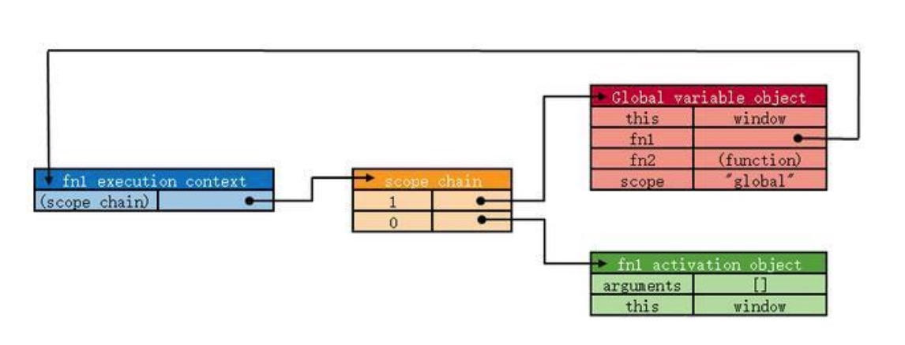
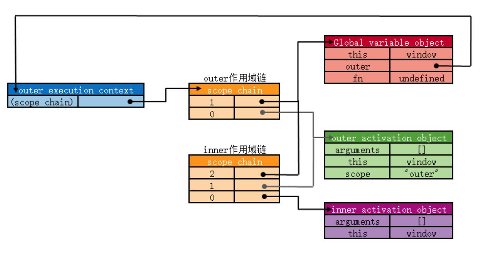
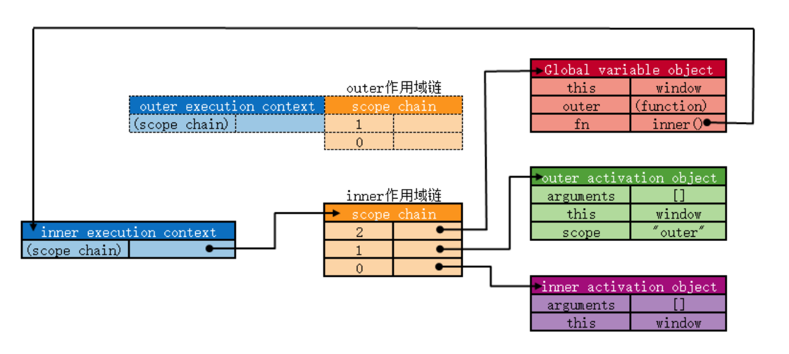

## 作用域、作用域链、闭包
### 作用域
- 变量作用域的类型：全局变量和局部变量
 - 对于最外层函数定义的变量用于全局作用域，即对任何函数来说，都是可以访问的。
 - 局部作用域一般只对局部的代码片段可以访问到，对于函数外部是无法访问的。
> 需要注意的是，函数内部声明变量的时候，一定要使用var，如果不用的话实际上是声明了一个全局变量

### 作用域链
函数对象和其他对象一样，用于可以通过代码访问的属性和一系列仅供js引擎访问的内部属性，其中一个内部属性是[[scope]]，该内部属性包含了函数被创建的作用域中对象的集合，这个集合被称为函数的作用域链，它决定了那些数据能被函数访问到。

``` javascript 
function fun() {
  var num = 1;
  alert(num);
}
func();
```

以上面函数fun为例，当函数第一次被调用的时候就会常见一个相应的``执行环境(execution context)``和对应的``作用域链``，并把作用域链赋值给一个特殊的内部属性[[scope]]。然后使用this，arguments和其他命名参数的值来初始化函数的活动对象（activation object）。当前执行环境的变量对象始终在作用域链的第0位



### 闭包
> 内部函数的作用域链仍然保持着对父函数活动对象的引用，就是``闭包``

``` javascript
function outer(){
  var scope = "outer";
    function inner(){
      return scope;
    }
    return inner;
  }
  var fn = outer();
  fn();
```

如上代码所示，outer在调用的时候，inner函数的作用域链就已经被初始化了（复制父函数的作用域链，再在前端插入自己的活动对象），如下图



一般来说，当某个环境中的所有代码执行完毕之后，该环境被销毁（弹出环境栈），保存其中的所有变量和函数也随之销毁（全局执行环境变量直到应用程序退出，如网页关闭才会被销毁）

但是像上面那种有内部函数的又有所不同，当outer()函数执行结束，执行环境被销毁，但是其关联的活动对象并没有随之销毁，而是一直存在于内存中，因为该活动对象被其内部函数的作用域链所引用。

具体如下图： 
outer执行结束，内部函数开始被调用 
outer执行环境等待被回收，outer的作用域链对全局变量对象和outer的活动对象引用都断了 



像上面这种内部函数的作用域链仍然保持着对父函数活动对象的引用，就是闭包(closure)

