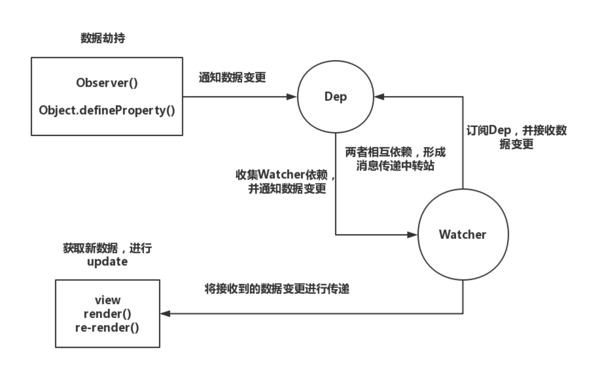

## vue

### 数据绑定实现原理



#### this[prop] => this.data.prop
众所周知，在vue中我们可以直接通过``this['prop']``的形式，获取``data()``的属性值
(ps：以下``vm``都指``Vue``原型类中的``this``)

- 通过``Vue``构造函数中的入参获取``$options.data()``的值，并把这个函数执行的返回值复制给 ``vm.$data``
- 通过``Object.defineProperty``, 直接定义``vm``下的各``prop``值，并进行数据劫持，get的时候，将直接获取``vm.$datap[prop]``的值，set的时候，将重置``vm.$datap[prop]``的值。

```javascript
function initData(vm) {
  var data = vm.$data = vm.$options.data();
  var keys = Object.keys(data);
  for (var i = 0; i < keys.length; i++) {
    (function(j) {
      var prop = keys[j];
      Object.defineProperty(vm, prop, {
        get: function() {
          return vm.$data[prop];
        },
        set: function(val) {
          vm.$data[prop] = val;
        }
      })
    })(i)
  }

  Observe(data);
}
```
#### 数据绑定模型
- Observe，消息中心，在这个方法中，我们将实现依赖的收集以及对于data的数据劫持工作。
- Dep，依赖者，每个data属性对通过作用域绑定一个dep对象，每个dep对象都有唯一id，该data属性所依赖的watcher也会存放在该对象中，``Dep.target``指向当前正在执行``get``方法的watcher对象。
- Watcher，订阅者，存放着所有收集了该watcher的dep的id(防止重复收集)以及重要各种操作函数，例如``更新dom的操作``、``computed计算属性的执行函数``

